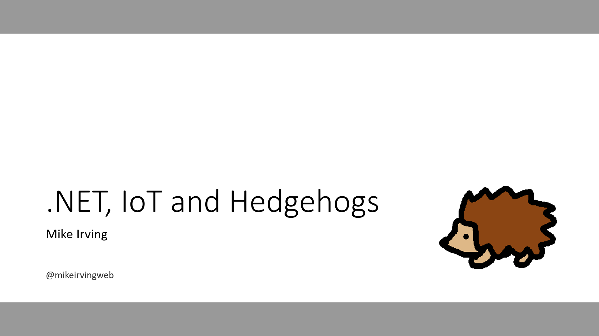

# .NET, IoT and Hedgehogs! 🦔
Presentation repo for my .NET, IoT and Hedgehogs talks

[www.macclesfieldhedgehogs.co.uk](https://www.macclesfieldhedgehogs.co.uk/)

## Forthcoming Talks
📅 Jan 31st 2023 - **Dot Net North** - [Meetup](https://www.meetup.com/dotnetnorth/events/290851422/) - [Slides](https://github.com/mikeirvingweb/dotnetconf22-windows/raw/main/presentation/2022-11-22-Mike-Irving-Windows.pptx)  
📅 Feb 2nd 2023 - **Macc Tech** - [Meetup](https://www.meetup.com/macctech/events/288873927/)  

## Code Repositories

🦔 [Macclesfield Hedgehogs website](https://github.com/mikeirvingweb/macclesfield-hedgehogs)  

🪣 [S3 Bucket Experiments](https://github.com/mikeirvingweb/S3BucketExperiments)  

🎥 [C# Camera Experiments](https://github.com/mikeirvingweb/CameraExperiments)  

---

### Links from presentation

**Microsoft PortQry**  
💻 [PortQry CLI](https://www.microsoft.com/en-us/download/details.aspx?id=17148)  
🖼️ [PortQryUI](https://www.microsoft.com/en-us/download/details.aspx?id=24009)  

**NuGet Packages**   
📶 [SimpleWifi.netstandard](https://www.nuget.org/packages/SimpleWifi.netstandard/)  
🔵 [InTheHand.BluetoothLE](https://www.nuget.org/packages/InTheHand.BluetoothLE) from [Peter Foot](twitter.com/PeterFoot)  
📼 [Xabe.FFmpeg](https://www.nuget.org/packages/Xabe.FFmpeg)  

**FFmpeg**  
📼 [FFmpeg project website](https://ffmpeg.org/)

**AWS Resources**  
🪣 [AWS S3 Examples for .NET](https://github.com/awsdocs/aws-doc-sdk-examples/tree/main/dotnetv3/S3)  
📼 [ffmpeg-lambda-layer](https://serverlessrepo.aws.amazon.com/applications/us-east-1/145266761615/ffmpeg-lambda-layer)  
🧩 [Building Lambda functions with C#](https://docs.aws.amazon.com/lambda/latest/dg/lambda-csharp.html)

**.NET Advent Calendar**  
🎄 [2022 Calendar](https://dotnet.christmas/2022)  
❄️ [Day 5 Entry](https://dotnet.christmas/2022/5)  

**Raspberry Pi**  
🍓 [Raspberry Pi Imager](https://www.raspberrypi.com/software/)  
📔 [Microsoft Learn - Deploy .NET apps to Raspberry Pi](https://learn.microsoft.com/en-us/dotnet/iot/deployment)  
💻 [Dot Net 7 with the Raspberry Pi](https://github.com/pjgpetecodes/dotnet7pi) from [Pete Gallagher](twitter.com/pete_codes)  

---
For more info, find / contact me at:  
[Twitter](https://twitter.com/mikeirvingweb) • [LinkedIn](https://www.linkedin.com/in/mikeirving) • [GitHub](https://github.com/mikeirvingweb) • [Stack Overflow](https://stackoverflow.com/users/482901/mike-irving) • [Website & Blog](https://www.mike-irving.co.uk/)
