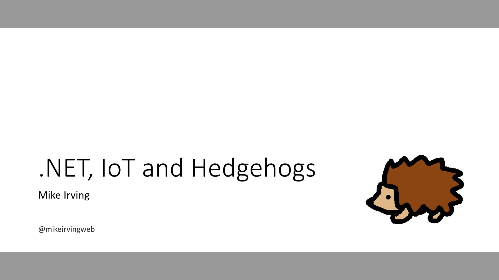
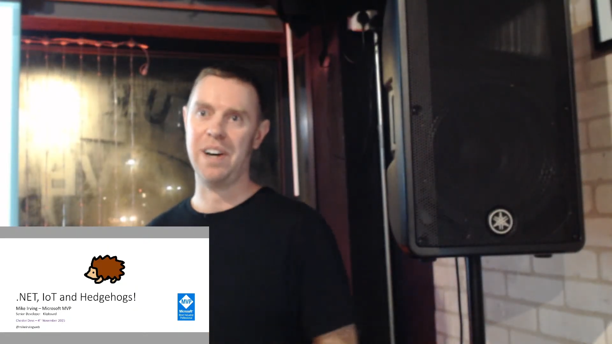
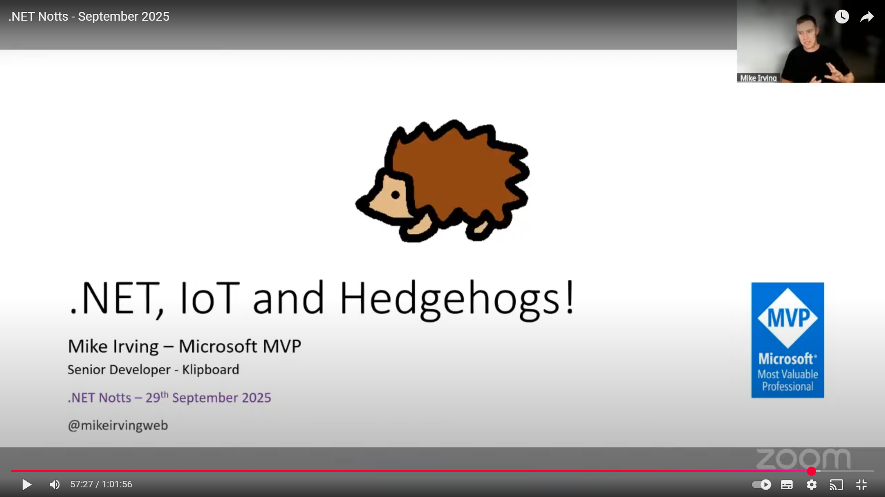
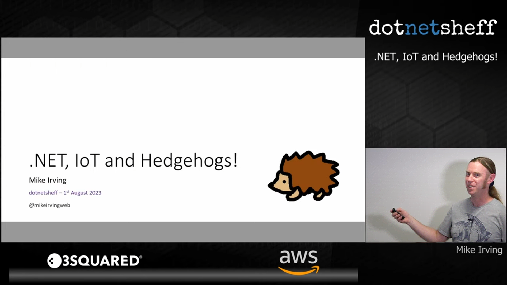

# .NET, IoT and Hedgehogs! 🦔
Presentation repo for my _.NET, IoT and Hedgehogs!_ talks

**Talk Description:**  

Using C# / .NET Technologies and IoT to curate and automate video footage of garden hedgehogs.  

An experimental journey through device access, cloud storage, serverless functions, and a public website.  

With an insight into problem-solving changes necessary to bring the code cross-platform to run on Linux on a Raspberry Pi.  

**Macclesfield Hedgehogs website**  
🦔 [mikeirvingweb.github.io/macclesfield-hedgehogs](https://mikeirvingweb.github.io/macclesfield-hedgehogs/)

**Blogs**  
📖 [.NET, IoT and Hedgehogs!](https://www.mike-irving.co.uk/web-design-blog/?blogid=122)  
📖 [Hedgehog System Evolution!](https://www.mike-irving.co.uk/web-design-blog/?blogid=123)  
📖 [Hedgehog Hardware and Detection](https://www.mike-irving.co.uk/web-design-blog/?blogid=124)  

## Forthcoming Talks
📅 May 14th 2026 - **Weblica, Croatia** - [Website](https://weblica.hr/en/)  

📅 Aug 12th 2026 - **Birmingham .Net & MAUI User Group** - [Meetup](https://www.meetup.com/birmingham-dotnet-and-xamarin-user-group/events/313959986/)  

## Past Talks  
📅 Nov 4th 2025 - **Chester Devs** - [Eventbrite](https://www.eventbrite.co.uk/e/net-iot-and-hedgehogs-mike-irving-tickets-1761040753299) - [Slides](https://mikeirvingweb.s3.amazonaws.com/dotnet-iot-and-hedgehogs/presentations/2025/2025-11-04-chester-devs/mike-irving-dotnet-iot-and-hedgehogs.pptx)  

📅 Sep 29th 2025 - **Dot Net Notts** - [Meetup](https://www.meetup.com/dotnetnotts/events/310952570/) - [Slides](https://mikeirvingweb.s3.amazonaws.com/dotnet-iot-and-hedgehogs/presentations/2025/2025-09-29-.net-notts/mike-irving-dotnet-iot-and-hedgehogs.pptx)  

📅 Jul 31st 2025 - **Staffs Web Meetup** - [Meetup](https://www.meetup.com/staffswebmeetup/events/305475184/) - [Slides](https://mikeirvingweb.s3.amazonaws.com/dotnet-iot-and-hedgehogs/presentations/2025/2025-07-31-staffs-web-meetup/mike-irving-dotnet-iot-and-hedgehogs.pptx)  

📅 Oct 31st 2023 - **Manchester Tech Festival** - [Website](https://www.manchestertechfestival.co.uk/software-engineering-tech-quality/) (content now offline) - [Slides](https://mikeirvingweb.s3.amazonaws.com/dotnet-iot-and-hedgehogs/presentations/2023/2023-10-31-manchester-tech-festival/mike-irving-dotnet-iot-and-hedgehogs.pptx)  

📅 Aug 15th 2023 - **.NET South West** - [Meetup](https://www.meetup.com/dotnetsouthwest/events/295066920/) - [Slides](https://mikeirvingweb.s3.amazonaws.com/dotnet-iot-and-hedgehogs/presentations/2023/2023-08-15-.net-south-west/mike-irving-dotnet-iot-and-hedgehogs.pptx)  

📅 Aug 1st 2023 - **dotnetsheff** - [Meetup](https://www.meetup.com/dotnetsheff/events/294085807/) - [Slides](https://mikeirvingweb.s3.amazonaws.com/dotnet-iot-and-hedgehogs/presentations/2023/2023-08-01-dotnetsheff/mike-irving-dotnet-iot-and-hedgehogs.pptx)  

📅 Jun 29th 2023 - **Leeds Sharp** - [Meetup](https://www.meetup.com/leeds-sharp/events/293228795) - [Slides](https://mikeirvingweb.s3.amazonaws.com/dotnet-iot-and-hedgehogs/presentations/2023/2023-06-29-leeds-sharp/mike-irving-dotnet-iot-and-hedgehogs.pptx)  

📅 Feb 28th 2023 - **Dot NET Liverpool** - [Meetup](https://www.meetup.com/dot-net-liverpool/events/291461997/) - [Slides](https://mikeirvingweb.s3.amazonaws.com/dotnet-iot-and-hedgehogs/presentations/2023/2023-02-28-dot-net-liverpool/mike-irving-dotnet-iot-and-hedgehogs.pptx)  

📅 Feb 2nd 2023 - **Macc Tech** - [Meetup](https://www.meetup.com/macctech/events/288873927/) - [Slides](https://mikeirvingweb.s3.amazonaws.com/dotnet-iot-and-hedgehogs/presentations/2023/2023-02-02-macc-tech/mike-irving-dotnet-iot-and-hedgehogs.pptx)  

📅 Jan 31st 2023 - **Dot Net North** - [Meetup](https://www.meetup.com/dotnetnorth/events/290851422/) - [Slides](https://mikeirvingweb.s3.amazonaws.com/dotnet-iot-and-hedgehogs/presentations/2023/2023-01-31-dot-net-north/mike-irving-dotnet-iot-and-hedgehogs.pptx)  

## Recorded Versions  

🍿 From Nov 4th 2025 @ **Chester Devs** - [YouTube](https://www.youtube.com/watch?v=cyi4ciApaBs&t=26s)  

  

🍿 From Sep 29th 2025 @ **.NET Notts (online)** - [YouTube](https://www.youtube.com/watch?v=Sc6QLeWbtUs&t=42s)  

  

🍿 From Aug 1st 2023 @ **dotnetsheff** - [YouTube](https://www.youtube.com/watch?v=9EBAIZkUXL8)  

  

## Code Repositories

🦔 [Macclesfield Hedgehogs website](https://github.com/mikeirvingweb/macclesfield-hedgehogs)  

🪣 [S3 Bucket Experiments](https://github.com/mikeirvingweb/S3BucketExperiments)  

🎥 [C# Camera Experiments](https://github.com/mikeirvingweb/CameraExperiments)  

---

### Links from presentation

**Microsoft PortQry**  
💻 [PortQry CLI](https://www.microsoft.com/en-us/download/details.aspx?id=17148)  
🖼️ [PortQryUI](https://www.microsoft.com/en-us/download/details.aspx?id=24009)  

**NuGet Packages**   
📶 [SimpleWifi.netstandard](https://www.nuget.org/packages/SimpleWifi.netstandard/)  
🔵 [InTheHand.BluetoothLE](https://www.nuget.org/packages/InTheHand.BluetoothLE) from [Peter Foot](https://bsky.app/profile/peterfoot.net)  
📼 [Xabe.FFmpeg](https://www.nuget.org/packages/Xabe.FFmpeg)  
🖼️ [SixLabors.ImageSharp](https://www.nuget.org/packages/SixLabors.ImageSharp)  
🔍 [ImageSharpCompare](https://www.nuget.org/packages/ImageSharpCompare/)  

**FFmpeg**  
📼 [FFmpeg project website](https://ffmpeg.org/)

**AWS Resources**  
🪣 [AWS S3 Examples for .NET](https://github.com/awsdocs/aws-doc-sdk-examples/tree/main/dotnetv3/S3)  
📼 [ffmpeg-lambda-layer](https://serverlessrepo.aws.amazon.com/applications/us-east-1/145266761615/ffmpeg-lambda-layer)  
🧩 [Building Lambda functions with C#](https://docs.aws.amazon.com/lambda/latest/dg/lambda-csharp.html)  
🔬 [Amazon Rekognition](https://aws.amazon.com/rekognition/)  

**.NET Advent Calendar**  
🎄 [2022 Calendar](https://dotnet.christmas/2022)  (content now offline)  
❄️ [Day 5 Entry](https://dotnet.christmas/2022/5)  (content now offline)  

**Raspberry Pi**  
🍓 [Raspberry Pi Imager](https://www.raspberrypi.com/software/)  
📔 [Microsoft Learn - Deploy .NET apps to Raspberry Pi](https://learn.microsoft.com/en-us/dotnet/iot/deployment?WT.mc_id=MVP_307078)  
💻 [Dot Net 7 with the Raspberry Pi](https://github.com/pjgpetecodes/dotnet7pi) from [Pete Gallagher](twitter.com/pete_codes)  

---
For more info, find / contact me at:  
[Bluesky](https://bsky.app/profile/mikeirvingweb.bsky.social) • [Twitter](https://twitter.com/mikeirvingweb) • [LinkedIn](https://www.linkedin.com/in/mikeirving) • [GitHub](https://github.com/mikeirvingweb) • [Stack Overflow](https://stackoverflow.com/users/482901/mike-irving) • [Website & Blog](https://www.mike-irving.co.uk/)
